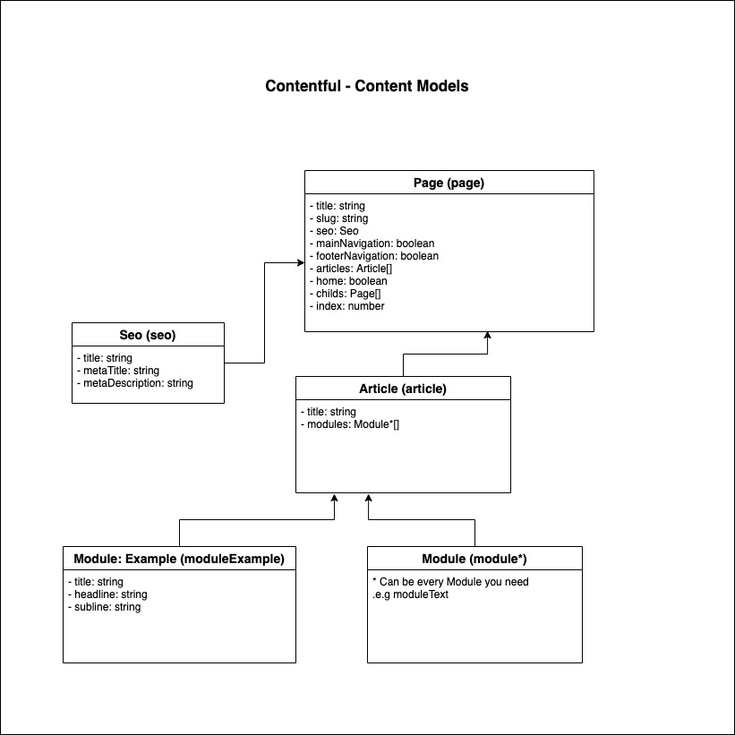

<p align="center"></p>

<p align="center">Nextful is a small framework on top of next.js for building websites with contentful.</p>

---

- ✅ready to use content model for website (page, SEO, open graph, articles)
- ✅ generates main and footer navigation based on your contentful content
- ✅ generates dynamic pages based on your slugs in contentful
- ✅ comes with an easy to use component mapper
- ✅ makes no decisions about your html structure or styles

## Table of contents

1. [ Prerequisites. ](#prerequisites)
2. [ Setup. ](#setup)
3. [ Content model. ](#content-model)
4. [ Create a new module. ](#create-a-new-module)
5. [ Support. ](#support)
5. [ Showcases. ](#showcases)

## Prerequisites
- you need to be able to run next.js
- you need to have a clean new contentful space (locale must be "en-US", it can be changed later)

## Setup

- Create a space for your project or pick
- Create an API key for your space
- Clone this repo via (Use this template or clone it)
- Install dependencies via `npm install`
- Install contentful-cli globally `npm install -g contentful-cli`
- Login in via `contentful login`
- Upload the content model `contentful space import --skip-content --skip-roles --skip-webhooks --content-file=content-model.json --space-id=YOUR_SPACE_ID` (replace YOUR_SPACE_ID with your space id!)
- Congrats you can now create pages, articles, and more
- create a file called `.env` in your root
- Store the following values CONTENTFUL_ACCESS_TOKEN and CONTENTFUL_SPACE_ID in your `.env`
- the values are shown on contentful in your API key
- you are now able to develop via `yarn dev`

## Content model



## Create a new module

To make a start easier. We placed an example module in the project.
You can delete it if you want.

Let´s see how we can add our module with the example module.

1. First, create a new content module in contentful. Fields are up to you.
Just create the fields you need. In your case, we have three fields (title, headline, subline)

2. To keep a better structure, we prefix our module with `Module: Example`. Contentful will create a content model with the id `moduleExample` and typename`ModuleExample`.

3. Now, let us create our module in next js. All modules are in the `modules` dir. We name our dir `ModuleExample`.

4. Create your main component `ModuleExample/ModuleExample.tsx`.

``` tsx
import { ReactPropTypes } from 'react';

const ModuleExample = ({ ...props }: any) => {
    return <div>{props.moduleExample.headline}</div>;
};

export default ModuleExample;
```

5. Now, let us create the module file `ModuleExample/module.ts`.

``` ts
import { createClient } from '@nextful/api/client';
import { createModule } from '@nextful/packages/module-connector';
import gql from 'graphql-tag';
import ModuleExample from './ModuleExample';

const client = createClient();

const Module = createModule({
    typename: 'ModuleExample',
    component: ModuleExample,
    async fetch(id) {
        // fetch your data via grapql or rest or fetch data from a different data source
        const dataOne = await somethingIWantToFetch();
        const dataTwo = await somethingIWantToFetchToo();

        // everything you return here will be injected into the component
        return {
            ...dataOne,
            ...dataTwo
        };
    },
    query: gql`
        
    `,
}9;

export default Module;
```

There you create an object from type `NextModule` with:

- typename: Typename of the content model
- component: Your component
- fetch(id): A function that gets the id of the module as an id. Everything returned from this function will be injected into the component

6. Now, you need to register your component. Import the module into `modules/mapping.ts` and export every module in an array

``` ts
import { Module as ModuleExample } from './ModuleExample';

export default [ModuleExample];
```

## Support

Let us know if you need support with your setup. Create an issue or contact janmarkuslanger10121994@gmail.com

We are also happy to discuss new features. Therefore you can create a new comment in your Featuee ideas discussion: https://github.com/contentfulnext/nextjs-contentful-website-boiler/discussions/47

## Showcases

- https://www.kaizen-kampfkunst.de/startseite
- https://schuettler.net/startseite
